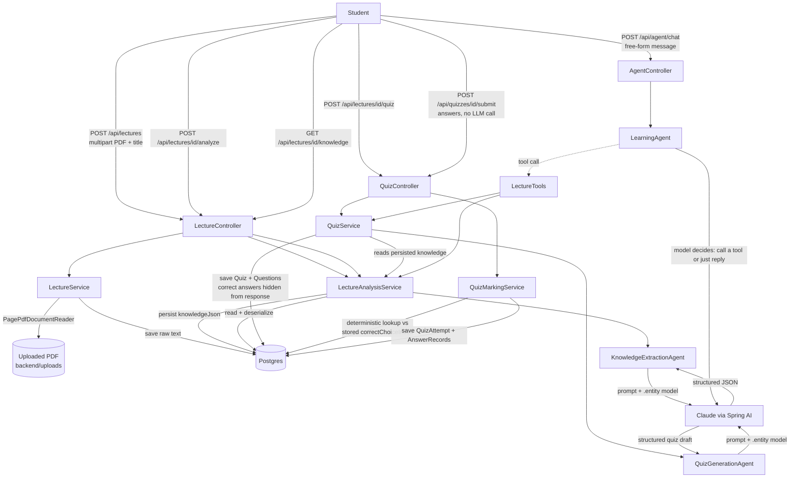

# Development Log

Running record of what was built, why it was built that way, and what went wrong along the
way. One section per stage of the [roadmap](ROADMAP.md). Newest stage at the bottom.

## Architecture so far

---

## Stage 1 — Project scaffold + lecture upload

**What was built**
- Spring Boot 4.1.1 / Java 21 Maven project (`backend/`), generated via the Spring
  Initializr API rather than by hand, so the wrapper (`mvnw`) and dependency versions are
  consistent with what `start.spring.io` currently recommends.
- Dependencies: `spring-boot-starter-web`, `spring-boot-starter-data-jpa`, `postgresql`,
  `spring-boot-starter-validation`, `lombok`, `spring-ai-starter-model-anthropic`,
  `spring-ai-starter-vector-store-pgvector`, `spring-ai-pdf-document-reader`,
  `spring-boot-docker-compose`.
- `Lecture` entity + `LectureRepository` (JPA).
- `LectureService`: saves an uploaded PDF to `backend/uploads/`, extracts its text with
  Spring AI's `PagePdfDocumentReader`, stores the raw text in Postgres.
- `LectureController`: `POST /api/lectures` (multipart upload), `GET /api/lectures`,
  `GET /api/lectures/{id}`.
- `compose.yaml` (Spring Boot's Docker Compose support): starts a `pgvector/pgvector`
  Postgres container automatically on `./mvnw spring-boot:run` **if Docker is running**.

**Why these choices**
- Structured PDF text extraction now, OCR later — most lecture slides/handouts have
  selectable text, so OCR would be solving a problem we don't have yet. Deferred to the
  roadmap's OCR stage.
- pgvector chosen over a separate vector DB (Pinecone/Chroma/etc.) so there's one database
  to run locally and one connection to manage — matters more at portfolio-project scale
  than picking a "production-grade" vector store.
- Spring AI's Anthropic starter (not OpenAI) since Claude is the model this project is
  being built with, and the job-description skills this project targets are
  provider-agnostic (agent orchestration, tool calling, RAG), not tied to a specific LLM.
- Raw lecture text is stored as a single `@Lob` column rather than chunked immediately —
  chunking only matters once RAG/embeddings show up (later stage); storing it whole keeps
  Stage 1 simple and is a non-breaking change to migrate off later.

**Issues faced**
- Spring Initializr's own metadata (`start.spring.io` dependency/version API) advertised
  the Spring Boot parent version as `4.1.1.RELEASE`. That artifact does not exist on Maven
  Central — Spring Boot 3+ dropped the `.RELEASE` qualifier from real artifact versions
  (that's a leftover from the Spring Boot 1.x/2.x naming convention, apparently still
  echoed in Initializr's `id` field for this version). `./mvnw compile` failed with
  *"Non-resolvable parent POM"* until the version in `pom.xml` was corrected to plain
  `4.1.1`. Lesson: always compile-check a generated project immediately instead of trusting
  the generator's version string.
- No Docker Desktop and no local Postgres installed on the dev machine yet, so the app
  hasn't been run end-to-end (only compiled) — `compose.yaml` needs Docker to auto-start
  Postgres. Tracked as an open item rather than worked around, since faking a datasource
  would hide a real environment gap.

---

## Stage 2 — Lecture understanding (Knowledge Extraction Agent)

**What was built**
- `LectureKnowledge` record (`dto` package): the structured shape a lecture transcript
  gets turned into — `learningGoals`, `keyConcepts` (topic/importance/summary),
  `keyTerms`, `commonMistakes`, `examTopics`. This is the contract every later stage
  (quiz generation, evaluation, exam simulation) will read from, instead of re-reading raw
  lecture text each time.
- `KnowledgeExtractionAgent` (new `agent` package): builds a `ChatClient` from the
  auto-configured `ChatClient.Builder` (wired up by the Anthropic starter), sends a prompt
  built from the lecture's title + transcript, and calls `.call().entity(LectureKnowledge.class)`
  — Spring AI handles the JSON-schema-constrained prompting and parses the model's response
  straight into the record, so there's no hand-rolled JSON parsing/repair logic.
- `LectureAnalysisService`: loads a `Lecture`, runs the agent, serializes the result to
  JSON via Jackson and persists it on the `Lecture` row (`knowledgeJson` column) so
  analysis isn't re-run (and re-billed) on every read.
- New endpoints: `POST /api/lectures/{id}/analyze` (runs the agent, persists, returns the
  result), `GET /api/lectures/{id}/knowledge` (returns the persisted result, 404s with a
  helpful message if `/analyze` hasn't been called yet).

**Why these choices**
- Asking the model for "a summary" was deliberately avoided — the prompt asks for the
  specific structure downstream stages need (learning goals, exam-relevant topics,
  common mistakes) so quiz generation later has something concrete to target instead of
  re-deriving structure from prose.
- Structured knowledge is stored as a single JSON text column rather than normalized into
  separate `key_concepts` / `key_terms` tables. A fully normalized schema is premature
  before it's clear which fields actually need querying (e.g. "find all lectures covering
  topic X") — that's a straightforward follow-up migration once the RAG/knowledge-base
  stage needs it, and not worth the join complexity yet.
- Transcript length is capped (15,000 chars) before it's sent to the model. Lecture text
  is currently stored and sent whole (see Stage 1 note); this cap is a stopgap against
  runaway token cost/latency on long lectures until real chunking + retrieval exists.
- Analysis is a separate, explicit `POST /analyze` call rather than running automatically
  on upload — keeps upload fast/cheap and lets the same lecture be re-analyzed later
  (e.g. after prompt changes) without re-uploading.

**Issues faced**
- None at compile time — `.call().entity(...)` matched this Spring AI BOM version
  (`2.0.1`) on the first attempt, so no API-shape surprises like Stage 1's Boot version
  issue.
- Still open: this hasn't been run against a live Postgres + real `ANTHROPIC_API_KEY` yet
  (same blocker as Stage 1 — no local Postgres/Docker on this machine). Compilation is
  verified; end-to-end behavior (does the model actually return well-formed
  `LectureKnowledge` for a real lecture PDF) is not yet verified and should be the first
  thing checked once Postgres is available.

---

## Stage 3 — Quiz Agent

**What was built**
- `Quiz` / `Question` JPA entities. A `Question` stores `topic` (which key concept it
  targets), `prompt`, a `choices` list (`@ElementCollection`, ordered), `correctChoiceIndex`,
  and `explanation`.
- `QuizGenerationAgent` (`agent` package): prompts Claude with the lecture's
  `LectureKnowledge` (learning goals, key concepts, terms, common mistakes, exam topics) —
  not the raw transcript — asking for a fixed number of multiple-choice questions, and
  parses the result via `.call().entity(QuizDraft.class)`.
- `QuizService`: fetches the lecture's persisted knowledge (delegates to
  `LectureAnalysisService.getKnowledge`, so it 404s with a clear message if `/analyze`
  hasn't run yet, instead of quietly generating a worse quiz from raw text), runs the
  agent, maps the draft into `Quiz`/`Question` entities, persists.
- `QuizResponse` DTO deliberately excludes `correctChoiceIndex` and `explanation` — the
  public "take this quiz" view must not leak the answer.
- Endpoints: `POST /api/lectures/{id}/quiz?count=5`, `GET /api/quizzes/{id}`.

**Why these choices**
- Generating from `LectureKnowledge` rather than raw transcript text mirrors the reasoning
  in Stage 2: cheaper per call (structured summary is much shorter than a full transcript),
  and questions come out anchored to concepts a human/agent already judged important,
  rather than the model re-deciding what matters every time a quiz is generated.
- Requiring `/analyze` to have already run (rather than triggering it implicitly from
  `/quiz`) keeps each agent doing one job and keeps the two LLM calls separately
  cacheable/re-runnable — you can regenerate a quiz from the same knowledge many times
  without re-extracting it.
- Answer-hiding lives in the DTO layer, not the entity — the entity always has the full
  answer key (needed for marking in Stage 4); only the HTTP response shape decides what's
  visible, which is the standard way to avoid "don't leak the field" bugs creeping back in
  if the entity is ever serialized directly by mistake.

**Issues faced**
- None at compile time. `.call().entity(QuizDraft.class)` with a nested record
  (`QuizDraft.QuestionDraft`) worked without needing a custom `ParameterizedTypeReference`
  — Spring AI's structured-output converter handles nested records directly.
- Same open item as Stage 1/2: not yet run against a live model/DB.

---

## Stage 4 — Student answers + automatic marking

**What was built**
- `QuizAttempt` / `AnswerRecord` entities: one `QuizAttempt` per submission, with one
  `AnswerRecord` per question (`selectedChoiceIndex`, and `correct` computed at
  construction time by comparing against `Question.correctChoiceIndex`).
- `QuizMarkingService`: validates every submitted `questionId` actually belongs to the
  quiz being submitted against (rejects cross-quiz answer submissions with 400), builds
  the attempt, saves it.
- `QuizAttemptResponse` DTO: the post-submission view, which — unlike `QuizResponse` —
  *does* include `correctChoiceIndex` and `explanation` per question, plus an overall
  `score`/`total`, since the student has now answered and revealing the key is the point.
- Endpoint: `POST /api/quizzes/{id}/submit`.

**Why these choices**
- Marking is implemented as a plain deterministic comparison, not a second LLM call. The
  correct answer was already decided at generation time (Stage 3) — re-asking a model
  "is this correct?" would add latency, cost, and a new source of inconsistency for a
  question that already has a known ground truth. (Free-text / short-answer grading,
  if added later, is the case that would actually need an LLM judge — multiple-choice
  does not.)
- This closes the loop the project's core goal describes: lecture transcript → structured
  key pointers (Stage 2) → quiz (Stage 3) → student attempts it → scored with explanations
  (Stage 4). Every remaining stage in [ROADMAP.md](ROADMAP.md) builds on top of this loop
  rather than replacing it (evaluation aggregates across attempts; exam mode adds
  constraints around taking a quiz; memory feeds attempt history back into generation).

**Issues faced**
- None at compile time.
- Same open item as every stage so far: verified by compilation only, not yet exercised
  against a live Postgres + Claude API key. This is now the top priority before adding
  further stages — the whole loop (Stages 1–4) should be smoke-tested end-to-end with one
  real lecture PDF once Docker/Postgres is available, rather than continuing to build on
  an unverified foundation.

---

## Stage 5 — Agent framework & tools (Harness Engineering)

**What was built**
- `LectureTools` (new `tools` package): the two capabilities the agent may use, as plain
  `@Component` methods annotated `@Tool`/`@ToolParam` — `getLectureKnowledge(lectureId)`
  and `generateQuiz(lectureId, questionCount)`. Each just delegates to the existing
  `LectureAnalysisService`/`QuizService` from Stages 2–3; no new business logic here, only
  the tool boundary around logic that already existed.
- `LearningAgent`: builds a `ChatClient` with a system prompt plus `.defaultTools(lectureTools)`,
  exposing one method, `converse(String studentMessage)`. Given a free-form message, the
  model itself decides whether to call a tool (and with what arguments) before replying,
  instead of a service hardcoding "always call X then Y."
- `POST /api/agent/chat` — the first endpoint in the project that isn't a fixed-purpose
  CRUD-ish call; it hands the raw student message to the agent and returns whatever it
  decides to say.

**Why these choices**
- Stages 2/3's agents (`KnowledgeExtractionAgent`, `QuizGenerationAgent`) are each called
  from exactly one place, for exactly one job — they don't need tool calling, a direct
  prompt-in/struct-out call is simpler and cheaper. `LearningAgent` is different: it's the
  one meant to field arbitrary requests ("what's in lecture 3?", "quiz me on lecture 5"),
  so it's the one that needs to *choose* what to do rather than being told.
- Tools were written as thin wrappers over existing services rather than new logic, on
  purpose — the harness principle here is that the model's capabilities should be exactly
  the same capabilities the rest of the app already exposes through its own services, not
  a separate, parallel set of "things the AI can do." One service method, one tool,
  no duplication.
- The system prompt explicitly tells the model to ask for a lecture id rather than
  guessing one — with no student/session/course concept yet (that's Stage 8), the agent
  has no way to know "which lecture the student means" on its own, so the honest instruction
  is to ask, not to hallucinate an id.
- This is the concrete answer to the target role's "Agent framework... toolchains...
  Harness Engineering" line: current practice describes a harness as more than a system
  prompt — instructions, tools, runtime, persistent state and feedback channels together
  ([LangChain: Anatomy of an Agent Harness](https://www.langchain.com/blog/the-anatomy-of-an-agent-harness)).
  `LectureTools` + `LearningAgent` + the persisted state from Stages 1–4 are the first three
  of those four pieces; the feedback/evaluation piece is Stage 6.

**Issues faced**
- None at compile time — `ChatClient.Builder.defaultTools(Object...)` and the
  `@Tool`/`@ToolParam` annotations resolved on the first attempt against the same Spring AI
  BOM version already in use.
- Same open item as every prior stage: compile-verified only. `/api/agent/chat` is the
  single most important thing to manually test once a live model is available, since tool
  selection (does the model actually call `getLectureKnowledge` when asked "what's lecture
  3 about?" instead of making something up) can't be confirmed by the compiler.
