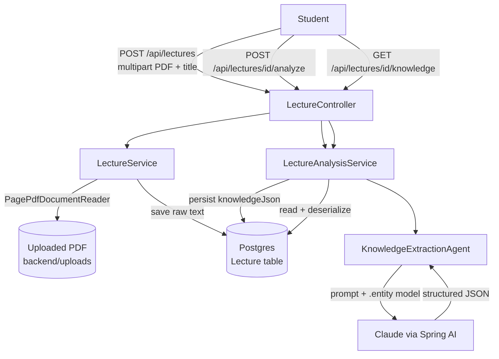

# Development Log

Running record of what was built, why it was built that way, and what went wrong along the
way. One section per stage of the [roadmap](README.md). Newest stage at the bottom.

## Architecture so far

---

## Stage 1 — Project scaffold + lecture upload

**What was built**
- Spring Boot 4.1.1 / Java 21 Maven project (`backend/`), generated via the Spring
  Initializr API rather than by hand, so the wrapper (`mvnw`) and dependency versions are
  consistent with what `start.spring.io` currently recommends.
- Dependencies: `spring-boot-starter-web`, `spring-boot-starter-data-jpa`, `postgresql`,
  `spring-boot-starter-validation`, `lombok`, `spring-ai-starter-model-anthropic`,
  `spring-ai-starter-vector-store-pgvector`, `spring-ai-pdf-document-reader`,
  `spring-boot-docker-compose`.
- `Lecture` entity + `LectureRepository` (JPA).
- `LectureService`: saves an uploaded PDF to `backend/uploads/`, extracts its text with
  Spring AI's `PagePdfDocumentReader`, stores the raw text in Postgres.
- `LectureController`: `POST /api/lectures` (multipart upload), `GET /api/lectures`,
  `GET /api/lectures/{id}`.
- `compose.yaml` (Spring Boot's Docker Compose support): starts a `pgvector/pgvector`
  Postgres container automatically on `./mvnw spring-boot:run` **if Docker is running**.

**Why these choices**
- Structured PDF text extraction now, OCR later — most lecture slides/handouts have
  selectable text, so OCR would be solving a problem we don't have yet. Deferred to the
  roadmap's OCR stage.
- pgvector chosen over a separate vector DB (Pinecone/Chroma/etc.) so there's one database
  to run locally and one connection to manage — matters more at portfolio-project scale
  than picking a "production-grade" vector store.
- Spring AI's Anthropic starter (not OpenAI) since Claude is the model this project is
  being built with, and the job-description skills this project targets are
  provider-agnostic (agent orchestration, tool calling, RAG), not tied to a specific LLM.
- Raw lecture text is stored as a single `@Lob` column rather than chunked immediately —
  chunking only matters once RAG/embeddings show up (later stage); storing it whole keeps
  Stage 1 simple and is a non-breaking change to migrate off later.

**Issues faced**
- Spring Initializr's own metadata (`start.spring.io` dependency/version API) advertised
  the Spring Boot parent version as `4.1.1.RELEASE`. That artifact does not exist on Maven
  Central — Spring Boot 3+ dropped the `.RELEASE` qualifier from real artifact versions
  (that's a leftover from the Spring Boot 1.x/2.x naming convention, apparently still
  echoed in Initializr's `id` field for this version). `./mvnw compile` failed with
  *"Non-resolvable parent POM"* until the version in `pom.xml` was corrected to plain
  `4.1.1`. Lesson: always compile-check a generated project immediately instead of trusting
  the generator's version string.
- No Docker Desktop and no local Postgres installed on the dev machine yet, so the app
  hasn't been run end-to-end (only compiled) — `compose.yaml` needs Docker to auto-start
  Postgres. Tracked as an open item rather than worked around, since faking a datasource
  would hide a real environment gap.

---

## Stage 2 — Lecture understanding (Knowledge Extraction Agent)

**What was built**
- `LectureKnowledge` record (`dto` package): the structured shape a lecture transcript
  gets turned into — `learningGoals`, `keyConcepts` (topic/importance/summary),
  `keyTerms`, `commonMistakes`, `examTopics`. This is the contract every later stage
  (quiz generation, evaluation, exam simulation) will read from, instead of re-reading raw
  lecture text each time.
- `KnowledgeExtractionAgent` (new `agent` package): builds a `ChatClient` from the
  auto-configured `ChatClient.Builder` (wired up by the Anthropic starter), sends a prompt
  built from the lecture's title + transcript, and calls `.call().entity(LectureKnowledge.class)`
  — Spring AI handles the JSON-schema-constrained prompting and parses the model's response
  straight into the record, so there's no hand-rolled JSON parsing/repair logic.
- `LectureAnalysisService`: loads a `Lecture`, runs the agent, serializes the result to
  JSON via Jackson and persists it on the `Lecture` row (`knowledgeJson` column) so
  analysis isn't re-run (and re-billed) on every read.
- New endpoints: `POST /api/lectures/{id}/analyze` (runs the agent, persists, returns the
  result), `GET /api/lectures/{id}/knowledge` (returns the persisted result, 404s with a
  helpful message if `/analyze` hasn't been called yet).

**Why these choices**
- Asking the model for "a summary" was deliberately avoided — the prompt asks for the
  specific structure downstream stages need (learning goals, exam-relevant topics,
  common mistakes) so quiz generation later has something concrete to target instead of
  re-deriving structure from prose.
- Structured knowledge is stored as a single JSON text column rather than normalized into
  separate `key_concepts` / `key_terms` tables. A fully normalized schema is premature
  before it's clear which fields actually need querying (e.g. "find all lectures covering
  topic X") — that's a straightforward follow-up migration once the RAG/knowledge-base
  stage needs it, and not worth the join complexity yet.
- Transcript length is capped (15,000 chars) before it's sent to the model. Lecture text
  is currently stored and sent whole (see Stage 1 note); this cap is a stopgap against
  runaway token cost/latency on long lectures until real chunking + retrieval exists.
- Analysis is a separate, explicit `POST /analyze` call rather than running automatically
  on upload — keeps upload fast/cheap and lets the same lecture be re-analyzed later
  (e.g. after prompt changes) without re-uploading.

**Issues faced**
- None at compile time — `.call().entity(...)` matched this Spring AI BOM version
  (`2.0.1`) on the first attempt, so no API-shape surprises like Stage 1's Boot version
  issue.
- Still open: this hasn't been run against a live Postgres + real `ANTHROPIC_API_KEY` yet
  (same blocker as Stage 1 — no local Postgres/Docker on this machine). Compilation is
  verified; end-to-end behavior (does the model actually return well-formed
  `LectureKnowledge` for a real lecture PDF) is not yet verified and should be the first
  thing checked once Postgres is available.
