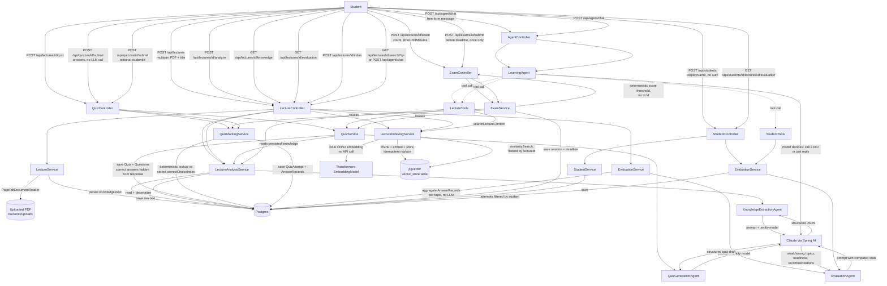

# Development Log

Running record of what was built, why it was built that way, and what went wrong along the
way. One section per stage of the [roadmap](ROADMAP.md). Newest stage at the bottom.

## Architecture so far

---

## Stage 1 — Project scaffold + lecture upload

**What was built**
- Spring Boot 4.1.1 / Java 21 Maven project (`backend/`), generated via the Spring
  Initializr API rather than by hand, so the wrapper (`mvnw`) and dependency versions are
  consistent with what `start.spring.io` currently recommends.
- Dependencies: `spring-boot-starter-web`, `spring-boot-starter-data-jpa`, `postgresql`,
  `spring-boot-starter-validation`, `lombok`, `spring-ai-starter-model-anthropic`,
  `spring-ai-starter-vector-store-pgvector`, `spring-ai-pdf-document-reader`,
  `spring-boot-docker-compose`.
- `Lecture` entity + `LectureRepository` (JPA).
- `LectureService`: saves an uploaded PDF to `backend/uploads/`, extracts its text with
  Spring AI's `PagePdfDocumentReader`, stores the raw text in Postgres.
- `LectureController`: `POST /api/lectures` (multipart upload), `GET /api/lectures`,
  `GET /api/lectures/{id}`.
- `compose.yaml` (Spring Boot's Docker Compose support): starts a `pgvector/pgvector`
  Postgres container automatically on `./mvnw spring-boot:run` **if Docker is running**.

**Why these choices**
- Structured PDF text extraction now, OCR later — most lecture slides/handouts have
  selectable text, so OCR would be solving a problem we don't have yet. Deferred to the
  roadmap's OCR stage.
- pgvector chosen over a separate vector DB (Pinecone/Chroma/etc.) so there's one database
  to run locally and one connection to manage — matters more at portfolio-project scale
  than picking a "production-grade" vector store.
- Spring AI's Anthropic starter (not OpenAI) since Claude is the model this project is
  being built with, and the job-description skills this project targets are
  provider-agnostic (agent orchestration, tool calling, RAG), not tied to a specific LLM.
- Raw lecture text is stored as a single `@Lob` column rather than chunked immediately —
  chunking only matters once RAG/embeddings show up (later stage); storing it whole keeps
  Stage 1 simple and is a non-breaking change to migrate off later.

**Issues faced**
- Spring Initializr's own metadata (`start.spring.io` dependency/version API) advertised
  the Spring Boot parent version as `4.1.1.RELEASE`. That artifact does not exist on Maven
  Central — Spring Boot 3+ dropped the `.RELEASE` qualifier from real artifact versions
  (that's a leftover from the Spring Boot 1.x/2.x naming convention, apparently still
  echoed in Initializr's `id` field for this version). `./mvnw compile` failed with
  *"Non-resolvable parent POM"* until the version in `pom.xml` was corrected to plain
  `4.1.1`. Lesson: always compile-check a generated project immediately instead of trusting
  the generator's version string.
- No Docker Desktop and no local Postgres installed on the dev machine yet, so the app
  hasn't been run end-to-end (only compiled) — `compose.yaml` needs Docker to auto-start
  Postgres. Tracked as an open item rather than worked around, since faking a datasource
  would hide a real environment gap.

---

## Stage 2 — Lecture understanding (Knowledge Extraction Agent)

**What was built**
- `LectureKnowledge` record (`dto` package): the structured shape a lecture transcript
  gets turned into — `learningGoals`, `keyConcepts` (topic/importance/summary),
  `keyTerms`, `commonMistakes`, `examTopics`. This is the contract every later stage
  (quiz generation, evaluation, exam simulation) will read from, instead of re-reading raw
  lecture text each time.
- `KnowledgeExtractionAgent` (new `agent` package): builds a `ChatClient` from the
  auto-configured `ChatClient.Builder` (wired up by the Anthropic starter), sends a prompt
  built from the lecture's title + transcript, and calls `.call().entity(LectureKnowledge.class)`
  — Spring AI handles the JSON-schema-constrained prompting and parses the model's response
  straight into the record, so there's no hand-rolled JSON parsing/repair logic.
- `LectureAnalysisService`: loads a `Lecture`, runs the agent, serializes the result to
  JSON via Jackson and persists it on the `Lecture` row (`knowledgeJson` column) so
  analysis isn't re-run (and re-billed) on every read.
- New endpoints: `POST /api/lectures/{id}/analyze` (runs the agent, persists, returns the
  result), `GET /api/lectures/{id}/knowledge` (returns the persisted result, 404s with a
  helpful message if `/analyze` hasn't been called yet).

**Why these choices**
- Asking the model for "a summary" was deliberately avoided — the prompt asks for the
  specific structure downstream stages need (learning goals, exam-relevant topics,
  common mistakes) so quiz generation later has something concrete to target instead of
  re-deriving structure from prose.
- Structured knowledge is stored as a single JSON text column rather than normalized into
  separate `key_concepts` / `key_terms` tables. A fully normalized schema is premature
  before it's clear which fields actually need querying (e.g. "find all lectures covering
  topic X") — that's a straightforward follow-up migration once the RAG/knowledge-base
  stage needs it, and not worth the join complexity yet.
- Transcript length is capped (15,000 chars) before it's sent to the model. Lecture text
  is currently stored and sent whole (see Stage 1 note); this cap is a stopgap against
  runaway token cost/latency on long lectures until real chunking + retrieval exists.
- Analysis is a separate, explicit `POST /analyze` call rather than running automatically
  on upload — keeps upload fast/cheap and lets the same lecture be re-analyzed later
  (e.g. after prompt changes) without re-uploading.

**Issues faced**
- None at compile time — `.call().entity(...)` matched this Spring AI BOM version
  (`2.0.1`) on the first attempt, so no API-shape surprises like Stage 1's Boot version
  issue.
- Still open: this hasn't been run against a live Postgres + real `ANTHROPIC_API_KEY` yet
  (same blocker as Stage 1 — no local Postgres/Docker on this machine). Compilation is
  verified; end-to-end behavior (does the model actually return well-formed
  `LectureKnowledge` for a real lecture PDF) is not yet verified and should be the first
  thing checked once Postgres is available.

---

## Stage 3 — Quiz Agent

**What was built**
- `Quiz` / `Question` JPA entities. A `Question` stores `topic` (which key concept it
  targets), `prompt`, a `choices` list (`@ElementCollection`, ordered), `correctChoiceIndex`,
  and `explanation`.
- `QuizGenerationAgent` (`agent` package): prompts Claude with the lecture's
  `LectureKnowledge` (learning goals, key concepts, terms, common mistakes, exam topics) —
  not the raw transcript — asking for a fixed number of multiple-choice questions, and
  parses the result via `.call().entity(QuizDraft.class)`.
- `QuizService`: fetches the lecture's persisted knowledge (delegates to
  `LectureAnalysisService.getKnowledge`, so it 404s with a clear message if `/analyze`
  hasn't run yet, instead of quietly generating a worse quiz from raw text), runs the
  agent, maps the draft into `Quiz`/`Question` entities, persists.
- `QuizResponse` DTO deliberately excludes `correctChoiceIndex` and `explanation` — the
  public "take this quiz" view must not leak the answer.
- Endpoints: `POST /api/lectures/{id}/quiz?count=5`, `GET /api/quizzes/{id}`.

**Why these choices**
- Generating from `LectureKnowledge` rather than raw transcript text mirrors the reasoning
  in Stage 2: cheaper per call (structured summary is much shorter than a full transcript),
  and questions come out anchored to concepts a human/agent already judged important,
  rather than the model re-deciding what matters every time a quiz is generated.
- Requiring `/analyze` to have already run (rather than triggering it implicitly from
  `/quiz`) keeps each agent doing one job and keeps the two LLM calls separately
  cacheable/re-runnable — you can regenerate a quiz from the same knowledge many times
  without re-extracting it.
- Answer-hiding lives in the DTO layer, not the entity — the entity always has the full
  answer key (needed for marking in Stage 4); only the HTTP response shape decides what's
  visible, which is the standard way to avoid "don't leak the field" bugs creeping back in
  if the entity is ever serialized directly by mistake.

**Issues faced**
- None at compile time. `.call().entity(QuizDraft.class)` with a nested record
  (`QuizDraft.QuestionDraft`) worked without needing a custom `ParameterizedTypeReference`
  — Spring AI's structured-output converter handles nested records directly.
- Same open item as Stage 1/2: not yet run against a live model/DB.

---

## Stage 4 — Student answers + automatic marking

**What was built**
- `QuizAttempt` / `AnswerRecord` entities: one `QuizAttempt` per submission, with one
  `AnswerRecord` per question (`selectedChoiceIndex`, and `correct` computed at
  construction time by comparing against `Question.correctChoiceIndex`).
- `QuizMarkingService`: validates every submitted `questionId` actually belongs to the
  quiz being submitted against (rejects cross-quiz answer submissions with 400), builds
  the attempt, saves it.
- `QuizAttemptResponse` DTO: the post-submission view, which — unlike `QuizResponse` —
  *does* include `correctChoiceIndex` and `explanation` per question, plus an overall
  `score`/`total`, since the student has now answered and revealing the key is the point.
- Endpoint: `POST /api/quizzes/{id}/submit`.

**Why these choices**
- Marking is implemented as a plain deterministic comparison, not a second LLM call. The
  correct answer was already decided at generation time (Stage 3) — re-asking a model
  "is this correct?" would add latency, cost, and a new source of inconsistency for a
  question that already has a known ground truth. (Free-text / short-answer grading,
  if added later, is the case that would actually need an LLM judge — multiple-choice
  does not.)
- This closes the loop the project's core goal describes: lecture transcript → structured
  key pointers (Stage 2) → quiz (Stage 3) → student attempts it → scored with explanations
  (Stage 4). Every remaining stage in [ROADMAP.md](ROADMAP.md) builds on top of this loop
  rather than replacing it (evaluation aggregates across attempts; exam mode adds
  constraints around taking a quiz; memory feeds attempt history back into generation).

**Issues faced**
- None at compile time.
- Same open item as every stage so far: verified by compilation only, not yet exercised
  against a live Postgres + Claude API key. This is now the top priority before adding
  further stages — the whole loop (Stages 1–4) should be smoke-tested end-to-end with one
  real lecture PDF once Docker/Postgres is available, rather than continuing to build on
  an unverified foundation.

---

## Stage 5 — Agent framework & tools (Harness Engineering)

**What was built**
- `LectureTools` (new `tools` package): the two capabilities the agent may use, as plain
  `@Component` methods annotated `@Tool`/`@ToolParam` — `getLectureKnowledge(lectureId)`
  and `generateQuiz(lectureId, questionCount)`. Each just delegates to the existing
  `LectureAnalysisService`/`QuizService` from Stages 2–3; no new business logic here, only
  the tool boundary around logic that already existed.
- `LearningAgent`: builds a `ChatClient` with a system prompt plus `.defaultTools(lectureTools)`,
  exposing one method, `converse(String studentMessage)`. Given a free-form message, the
  model itself decides whether to call a tool (and with what arguments) before replying,
  instead of a service hardcoding "always call X then Y."
- `POST /api/agent/chat` — the first endpoint in the project that isn't a fixed-purpose
  CRUD-ish call; it hands the raw student message to the agent and returns whatever it
  decides to say.

**Why these choices**
- Stages 2/3's agents (`KnowledgeExtractionAgent`, `QuizGenerationAgent`) are each called
  from exactly one place, for exactly one job — they don't need tool calling, a direct
  prompt-in/struct-out call is simpler and cheaper. `LearningAgent` is different: it's the
  one meant to field arbitrary requests ("what's in lecture 3?", "quiz me on lecture 5"),
  so it's the one that needs to *choose* what to do rather than being told.
- Tools were written as thin wrappers over existing services rather than new logic, on
  purpose — the harness principle here is that the model's capabilities should be exactly
  the same capabilities the rest of the app already exposes through its own services, not
  a separate, parallel set of "things the AI can do." One service method, one tool,
  no duplication.
- The system prompt explicitly tells the model to ask for a lecture id rather than
  guessing one — with no student/session/course concept yet (that's Stage 8), the agent
  has no way to know "which lecture the student means" on its own, so the honest instruction
  is to ask, not to hallucinate an id.
- This is the concrete answer to the target role's "Agent framework... toolchains...
  Harness Engineering" line: current practice describes a harness as more than a system
  prompt — instructions, tools, runtime, persistent state and feedback channels together
  ([LangChain: Anatomy of an Agent Harness](https://www.langchain.com/blog/the-anatomy-of-an-agent-harness)).
  `LectureTools` + `LearningAgent` + the persisted state from Stages 1–4 are the first three
  of those four pieces; the feedback/evaluation piece is Stage 6.

**Issues faced**
- None at compile time — `ChatClient.Builder.defaultTools(Object...)` and the
  `@Tool`/`@ToolParam` annotations resolved on the first attempt against the same Spring AI
  BOM version already in use.
- Same open item as every prior stage: compile-verified only. `/api/agent/chat` is the
  single most important thing to manually test once a live model is available, since tool
  selection (does the model actually call `getLectureKnowledge` when asked "what's lecture
  3 about?" instead of making something up) can't be confirmed by the compiler.

---

## Stage 6 — Evaluation Agent (automatic evaluation system)

**What was built**
- `TopicStats` (dto): `topic`, `totalAnswered`, `correctAnswered`, `accuracy` — computed
  with plain Java, no LLM involved.
- `EvaluationService.evaluateLecture(lectureId)`: finds every `Quiz` generated from the
  lecture, every `QuizAttempt` against those quizzes, and tallies `AnswerRecord`s by
  `Question.topic` into `TopicStats`.
- `EvaluationDraft` (dto, the model's raw output) / `EvaluationResult` (dto, the API
  response = `EvaluationDraft` + the `TopicStats` it was computed from) — kept as two
  types on purpose, see below.
- `EvaluationAgent`: takes the lecture's title, its `LectureKnowledge`, and the computed
  `TopicStats`, and asks the model to classify weak/strong topics, an overall readiness
  label (`NOT_READY`/`DEVELOPING`/`MODERATE`/`READY`), and 3-5 recommendations — explicitly
  told to treat the given numbers as ground truth, not to recompute them.
- `GET /api/lectures/{id}/evaluation` on `LectureController`.
- Small refactor while writing this: `QuizGenerationAgent`'s private `bulletList` helper
  (needed again here) moved to a shared package-private `PromptText` utility instead of
  being copy-pasted a second time.

**Why these choices**
- Split `EvaluationDraft`/`EvaluationResult` instead of one record with everything: if the
  model's structured-output type includes `topicStats`, nothing stops it from "helpfully"
  inventing or rounding those numbers itself. Keeping the deterministic numbers out of the
  type the model fills in, and merging them in afterward in code, removes that failure mode
  entirely rather than just prompting against it.
- Evaluation is scoped **per lecture, across all attempts**, not per-student — there is no
  student/account/session concept anywhere in the app yet. Scoping by lecture is the
  correct granularity for a single-user tool today, and is a one-line repository query
  change to re-scope by student once Stage 8 adds that concept — the tally logic itself
  doesn't need to change, only which attempts get fed into it.
- The prompt explicitly forbids the model from re-deriving the percentages ("treat these
  numbers as ground truth") for the same reason Stage 4's marking is deterministic: a
  known, already-computed quantity should not be handed to an LLM to potentially get
  slightly wrong.

**Issues faced**
- None at compile time. `findByQuizIdIn(List<Long>)` on `QuizAttemptRepository` — a
  derived query traversing the `quiz.id` nested property — resolved correctly without
  needing a custom `@Query`.
- Same open item as every stage so far: compile-verified only, not yet run against a real
  quiz attempt history. Also newly blocked on something outside the app entirely: Docker
  Desktop's WSL2 backend reports hardware virtualization (Intel VT-x) is disabled in this
  machine's BIOS/UEFI firmware — `wsl --status` names it directly. That's a firmware
  setting, not something fixable from a terminal; it needs a manual BIOS visit and reboot
  before Docker (and therefore Postgres, and therefore any live end-to-end test) can work
  on this machine.
- Update: VT-x was confirmed enabled in firmware (Task Manager → Performance → CPU shows
  "Virtualisation: Enabled") after the BIOS visit, but `wsl --status` still reports the
  same error. The remaining gap is a Windows optional component ("Virtual Machine
  Platform") that WSL's own message says isn't on, distinct from the firmware bit -
  `wsl.exe --install --no-distribution` (run elevated) is what WSL itself suggests.
  Checking or changing this needs an elevated shell, which this session doesn't have
  (`Get-WindowsOptionalFeature` itself failed with "requires elevation") - genuinely
  outside what's fixable from here, left for the user to run.
- **Resolved**: the user ran `wsl.exe --install --no-distribution` from an elevated
  PowerShell and rebooted. `docker ps`/`docker info` now succeed. Three separate things
  had to be true before Docker Desktop's WSL2 backend would actually work on this machine,
  and each was fixed by a different action: hardware VT-x enabled in BIOS/UEFI (manual
  firmware change) → the "Virtual Machine Platform" Windows optional component enabled
  (`wsl.exe --install --no-distribution`, elevated) → a reboot to apply both. The full
  smoke test in the next stage entry is the first time anything in this project has run
  against a real Postgres instance rather than compiling in isolation.

---

## Stage 7 — Exam Simulation (sandbox / simulation environment)

**What was built**
- `ExamStatus` enum (`IN_PROGRESS`, `SUBMITTED`, `EXPIRED`) and `ExamSession` entity: wraps
  a `Quiz` with `startedAt`, `timeLimitSeconds`, `status`, and (once graded) a link to the
  resulting `QuizAttempt`. `deadline()`/`isExpired(Instant)` are plain entity methods.
- `ExamService`: `startExam` generates a quiz via the existing `QuizService` (same
  `QuizGenerationAgent` as Stage 3 — an exam's questions are not a different kind of
  content) and wraps it in a new `ExamSession`. `submitExam` enforces the two things a
  practice quiz doesn't: reject if the session isn't `IN_PROGRESS` (already submitted),
  and reject if `Instant.now()` is past the deadline (marking the session `EXPIRED` first)
  — otherwise delegates to the existing `QuizMarkingService.submit(...)` unchanged.
- `estimateReadiness(QuizAttempt)`: a plain score-percentage threshold
  (`READY`/`MODERATE`/`DEVELOPING`/`NOT_READY`) — deliberately not a second call to
  `EvaluationAgent`; see below.
- Endpoints: `POST /api/lectures/{id}/exam?count=&timeLimitMinutes=`,
  `GET /api/exams/{id}`, `POST /api/exams/{id}/submit`.

**Why these choices**
- An exam is modeled as *constraints wrapped around* the existing Quiz/QuizAttempt
  pipeline, not a parallel implementation. `ExamSession` has no `questions` or `answers`
  fields of its own — it references a `Quiz` and (later) a `QuizAttempt` and adds nothing
  but timing/state. This is what the roadmap's framing of "sandbox" as *a bounded,
  controlled environment the agent operates a session inside of* actually means in
  practice: the content-generation and grading logic underneath don't change, only what's
  allowed to happen around them (one shot, before a deadline).
- `estimateReadiness` intentionally does not call an LLM. `EvaluationAgent` (Stage 6)
  already exists for reasoned, multi-attempt, per-topic feedback; re-running something
  similar per single exam submission would be a slower, costlier, less consistent version
  of a plain `score/total` threshold that a percentage already answers just as well. The
  two are meant to coexist: `/submit` returns an instant, free, deterministic readiness
  label, `GET /api/lectures/{id}/evaluation` (Stage 6) gives the deeper "why" whenever the
  student wants it, across every attempt including exams (`QuizAttempt`/`AnswerRecord`
  don't distinguish exam-mode attempts from practice ones, so Stage 6 sees both).
- Expiry is checked, not enforced by a scheduled job — a session past its deadline simply
  fails validation the next time someone tries to submit against it, flipping its status
  to `EXPIRED` at that point. Good enough for a single-user tool; a background sweep to
  proactively expire stale sessions is a Stage-11-frontend-era concern (a UI countdown
  timer needs it more than the backend does).

**Issues faced**
- None at compile time.
- Same open item as every stage: compile-verified only. Additionally still blocked on the
  Windows optional component issue above — Docker/Postgres still not reachable from this
  machine as of this stage, so Stages 1–7 remain entirely unexercised end-to-end.

---

## Live smoke test — Stages 1–7 against real Postgres

With Docker finally working (see the resolved note above), this is the first time
anything in this project ran instead of just compiling. Two real bugs surfaced in the
first thirty seconds of ever actually booting the app — exactly the kind of thing that
compile-checking alone cannot catch, and the reason every stage above kept flagging
"not yet run" as the top risk.

**Bug 1 — no `ObjectMapper` bean.** `LectureAnalysisService` (Stage 2) failed to start:
`Parameter 2 of constructor ... required a bean of type
'com.fasterxml.jackson.databind.ObjectMapper' that could not be found`. Cause: Spring Boot
4 has moved its own auto-configured `ObjectMapper` to Jackson 3 (new `tools.jackson.*`
groupId/package) — `com.fasterxml.jackson.databind.ObjectMapper` (Jackson 2, what the
code was written against) is still on the classpath, but only as a transitive dependency
of Spring AI's JSON-schema tooling, with no bean of that type auto-configured anymore.
Fixed by adding `com.examagent.config.JacksonConfig`, an explicit `@Bean ObjectMapper`
of the classic Jackson 2 type, used only by `LectureAnalysisService` for the
`knowledgeJson` column — unrelated to (and doesn't change) how HTTP responses get
serialized, which still goes through Boot's own Jackson 3 auto-configuration.

**Bug 2 — pgvector's `VectorStore` auto-config needs an `EmbeddingModel`.**
`PgVectorStoreAutoConfiguration` failed: no `EmbeddingModel` bean available. Cause:
`spring-ai-starter-vector-store-pgvector` was added in Stage 1 in anticipation of Stage 9
(RAG), but Anthropic has no Spring AI embeddings starter, so nothing provides an
`EmbeddingModel` — a dependency that looked harmless at compile time turned out to hard-fail
app *startup*. Fixed for now with `spring.autoconfigure.exclude=...PgVectorStoreAutoConfiguration`
in `application.properties`, with a comment marking it for removal once Stage 9 adds a
real embedding model (e.g. Ollama running locally). Lesson for both bugs: a dependency
that compiles clean can still break at runtime through auto-configuration - added early
"for later" is exactly the kind of dependency that needs an actual boot, not just a
compile, before being trusted.

**What was actually verified**, after both fixes, app started in ~14s:
- Real Postgres connection (Hikari pool, Postgres 16.15, via the `compose.yaml` container
  from Stage 1) — first real proof that container works at all.
- Hibernate created all 7 expected tables from a clean database with no manual schema
  work: `lecture`, `quiz`, `question`, `question_choices`, `quiz_attempt`,
  `answer_record`, `exam_session` (`\dt` via `docker exec ... psql`) — confirms the JPA
  mappings across Stages 1, 3, 4 and 7 are structurally correct.
- `POST /api/lectures` end-to-end with a real (small, hand-built) PDF: file saved,
  `PagePdfDocumentReader` extracted 3293 characters of real text, row persisted, returned
  `analyzed: false` as expected. `GET /api/lectures` and `GET /api/lectures/{id}` both
  correct.

**Not yet verified**: everything that calls Claude — Stage 2 (`/analyze`), Stage 3
(`/quiz`), Stage 5 (`/agent/chat`), Stage 6 (`/evaluation`), and submitting a Stage 7 exam
all require `ANTHROPIC_API_KEY`, which is not set in this environment. Offered to wait for
the user to set it; they chose to keep building instead, so this remains open - every
LLM-calling endpoint below is still compile-verified only, same caveat as Stages 1-7 had
before the live Postgres test.

---

## Stage 8 — Personalized memory

**What was built**
- `Student` entity: deliberately minimal (`displayName`, `createdAt`, no password/auth) -
  an identity to hang history off of, not a real accounts system. `QuizAttempt` gets a
  nullable `student` reference, set only when a submission names one
  (`QuizSubmissionRequest.studentId`, optional) — an attempt with no student is still a
  valid, ungraded-by-name-but-fully-graded attempt, so nothing before this stage breaks.
- `EvaluationService` refactored: the Stage 6 aggregation/agent-call logic is now shared
  by two entry points — `evaluateLecture` (everyone's attempts, unchanged) and the new
  `evaluateStudentOnLecture(lectureId, studentId)`, which filters attempts to one student
  via a new repository query (`findByQuizIdInAndStudentId`) before the same
  tally/agent-call path runs.
- `StudentTools` (new, alongside `LectureTools`): a `getStudentHistory(studentId,
  lectureId)` tool wrapping `evaluateStudentOnLecture` - this is exactly the tool
  `LectureTools` was missing at Stage 5 (noted in that stage's own log entry as "no
  student/history concept exists yet"). `LearningAgent` now takes both tool components and
  its system prompt was extended to mention personal-progress questions.
- Endpoints: `POST /api/students`, `GET /api/students/{id}`,
  `GET /api/students/{id}/lectures/{lectureId}/evaluation`; `POST /api/quizzes/{id}/submit`
  now accepts an optional `studentId` in its body.

**Why these choices**
- No authentication was added. Building real login/sessions is its own scope entirely and
  not what "personalized memory" in the target role is actually testing for - the point is
  the *memory* mechanism (scoping history to an identity, feeding it back through a tool),
  which is fully demonstrated without auth. `Student` is shaped so a real auth system could
  attach to it later (map an authenticated user to a `Student` row) without touching
  `QuizAttempt`, `EvaluationService`, or the tool at all.
- Reused Stage 6's aggregation/agent code path rather than writing a second one for the
  personalized case - the only thing that should differ between "how is the class doing"
  and "how is this one student doing" is which attempts get counted, not how they get
  interpreted. Two thin methods sharing one private `evaluate(...)` core, not two parallel
  implementations.
- `studentId` is optional on submission rather than required, and attempts stay valid
  without one. Forcing every quiz/exam submission to name a student would have meant
  either inventing a fake default student or breaking every endpoint built in Stages 3/4/7
  — an opt-in field was the non-breaking path, consistent with how Stage 6's per-lecture
  (not per-student) evaluation was explicitly designed in its own log entry to be "a
  straightforward migration... once accounts exist" rather than a rewrite.

**Issues faced**
- None at compile time.
- Verified live, no LLM required for most of it: `POST /api/students` → `GET
  /api/students/{id}` round-tripped correctly; `GET /api/students/999` correctly 404s;
  `GET /api/students/1/lectures/1/evaluation` correctly 404s with "no quizzes generated
  yet" (lecture 1 has no quiz - blocked on the same missing `ANTHROPIC_API_KEY`).
  Hibernate's `ddl-auto=update` cleanly added the new `student` table and a nullable
  `student_id` FK column onto the existing `quiz_attempt` table with no manual migration
  needed (confirmed via `\d quiz_attempt` in the running container). Not yet verified:
  `StudentTools.getStudentHistory` actually being called correctly by `LearningAgent` -
  needs a live model, same open item as everything else that calls Claude.

---

## Stage 9 — RAG / Knowledge base (pgvector)

**What was built**
- Added `spring-ai-starter-model-transformers` — Spring AI's local, in-JVM ONNX embedding
  model (all-MiniLM-L6-v2, run via DJL/PyTorch, downloaded once and cached on first use).
  This finally provides the `EmbeddingModel` bean that `PgVectorStoreAutoConfiguration`
  was missing since Stage 1, so the `spring.autoconfigure.exclude` workaround from the
  Stage 8 smoke-test entry is removed — pgvector's auto-configuration now just works.
  Chosen specifically to avoid adding *another* external service to run (no Ollama
  daemon, no OpenAI/other API key) — everything Stage 9 needs runs inside the same JVM.
- `Lecture.indexedAt` (nullable, mirrors `knowledgeJson`'s "null until analyzed" pattern)
  and an `indexed` flag on `LectureResponse`.
- `LectureIndexingService`: `index(lectureId)` splits the lecture's raw text with Spring
  AI's `TokenTextSplitter`, tags each chunk's metadata with `lectureId`/`lectureTitle`,
  and calls `VectorStore.add(...)` - but deletes any existing chunks for that lecture
  first (`VectorStore.delete(filterExpression)`), so re-indexing replaces rather than
  duplicates. `search(lectureId, query, topK)` runs `VectorStore.similaritySearch(...)`
  with a `lectureId` filter, so results never cross between lectures.
- `LectureTools.searchLectureContent(lectureId, query)`: a new tool alongside
  `getLectureKnowledge`/`generateQuiz`, so `LearningAgent` can pull a specific verbatim
  passage when the structured `LectureKnowledge` summary isn't detailed enough to answer
  precisely - the "agentic RAG" pattern from the original roadmap research (the agent
  decides if/when to retrieve, rather than every prompt always retrieving).
- Endpoints: `POST /api/lectures/{id}/index`, `GET /api/lectures/{id}/search?q=...` (a
  manual/debug entry point to the exact same search the agent tool uses).

**Why these choices**
- RAG is additive, not a replacement for Stage 2/3. `KnowledgeExtractionAgent` and
  `QuizGenerationAgent` still work off the capped whole transcript / `LectureKnowledge` as
  before - that remains the right approach for "understand/quiz this one lecture as a
  whole." What Stage 9 adds is precision lookup: a specific verbatim passage on demand,
  useful once transcripts exceed the cap or search needs to span multiple lectures. Both
  approaches coexist deliberately rather than one replacing the other.
- Indexing is a separate, explicit step (`POST /.../index`), not automatic on upload or
  analysis - same reasoning as Stage 2's separate `/analyze` step: keeps upload fast and
  makes re-indexing (e.g. after changing chunk-size strategy) possible without
  re-uploading or re-extracting text.
- Search results are scoped to one lecture via a metadata filter rather than searching
  globally across every lecture in the vector store. Cross-lecture search is a real future
  use case (roadmap's own note: "worth adopting once there's more than one lecture per
  course to search across") but scoping it now would mean the tool could accidentally
  surface another course's content in an answer - narrower and correct first, broadened
  deliberately later once there's an actual multi-lecture scenario to design against.

**Issues faced**
- **Real bug, caught live**: the first `/index` call failed with
  `org.postgresql.util.PSQLException: ERROR: relation "public.vector_store" does not
  exist`, despite a log line reading `Initializing PGVectorStore schema for table:
  vector_store` right before it — that log line fires regardless of whether schema
  creation actually happens. Cause: `spring.ai.vectorstore.pgvector.initialize-schema`
  defaults to `false` (deliberately, same caution as `spring.jpa.hibernate.ddl-auto`
  defaulting conservatively) - Stage 1 never set it because nothing exercised pgvector
  until now. Fixed with `spring.ai.vectorstore.pgvector.initialize-schema=true` in
  `application.properties`, with a comment noting a real deployment would use an explicit
  migration instead of auto-init.
- Everything else verified live end-to-end on the first attempt after that fix: uploaded
  a real PDF, `POST /api/lectures/{id}/index` succeeded and flipped `indexed: true`,
  `GET /api/lectures/{id}/search?q=...` returned real semantically-matched content for
  two different natural-language queries against real locally-computed embeddings stored
  in real pgvector. Confirmed idempotency directly against the container
  (`SELECT count(*) FROM vector_store WHERE metadata->>'lectureId' = '2'`): 1 row before
  a second `/index` call, 1 row after - no duplication.
- Not yet verified: `LectureTools.searchLectureContent` actually being invoked correctly
  by `LearningAgent` (needs a live model - same open item as every Claude-calling piece).
